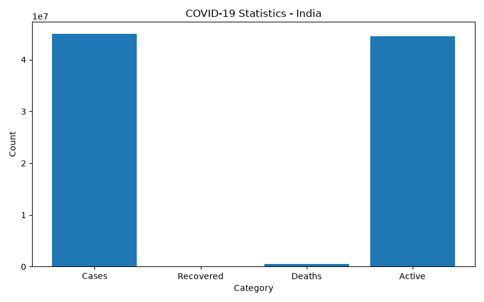

# Data Engineering Pipeline

A beginner-friendly Data Engineering Pipeline project built with Python. This project demonstrates the complete ETL (Extract, Transform, Load) process by fetching COVID-19 data from a public API, transforming it into a structured format, storing it in a SQLite database, and visualizing the results.

---

## Features

- Extracts real-time COVID-19 data from a public API
- Transforms JSON data into a clean CSV file
- Loads data into a SQLite database
- Generates a bar chart visualization
- Runs the complete ETL pipeline with a single command

---

## Technologies Used

- Python
- Pandas
- Requests
- SQLite
- Matplotlib
- VS Code
- Git & GitHub

---

## Project Structure

```text
Data-Engineering-Pipeline/
│
├── data/
│   ├── raw_data.json
│   └── cleaned_data.csv
│
├── database/
│   └── covid_data.db
│
├── output/
│   └── chart.png
│
├── scripts/
│   ├── extract.py
│   ├── transform.py
│   ├── load.py
│   └── visualize.py
│
├── main.py
├── requirements.txt
├── README.md
├── .gitignore
└── LICENSE
```

---

## Installation

Clone the repository:

```bash
git clone https://github.com/your-username/Data-Engineering-Pipeline.git
```

Navigate to the project folder:

```bash
cd Data-Engineering-Pipeline
```

Install the required libraries:

```bash
pip install -r requirements.txt
```

Run the complete pipeline:

```bash
python main.py
```

---

## Output

The pipeline generates:

- `raw_data.json`
- `cleaned_data.csv`
- `covid_data.db`
- `chart.png`

---

## Output Screenshot



## ETL Workflow

```
Extract Data
      ↓
Transform Data
      ↓
Load into Database
      ↓
Visualize Data
```

---

## Future Improvements

- Add logging
- Schedule automatic pipeline execution
- Store data in PostgreSQL
- Create an interactive dashboard
- Dockerize the application

---

## Author

**Jehonisse**

GitHub: https://github.com/jehonissy